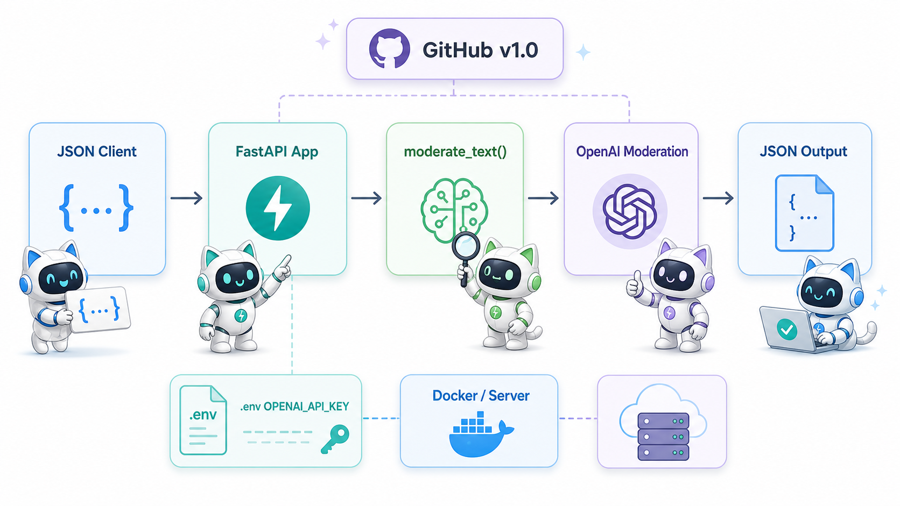
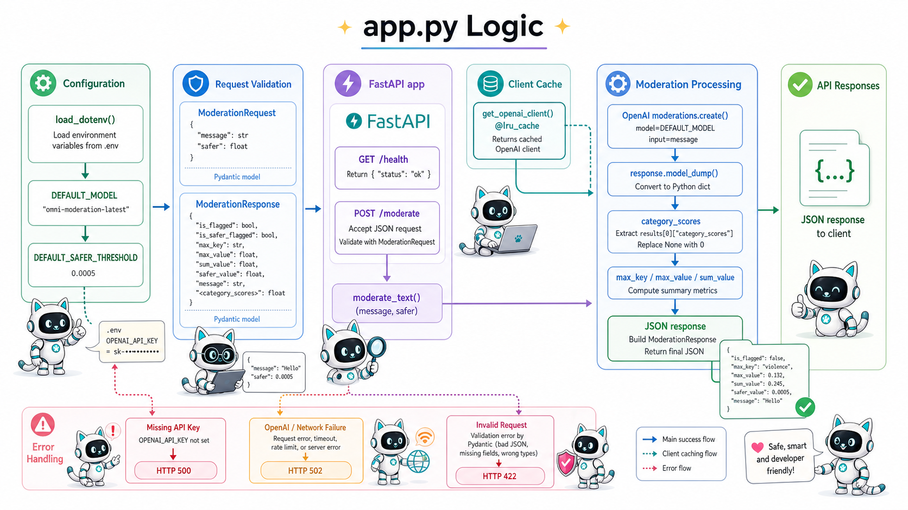

# Moderation NLP Server

This project is a lightweight server-side API for text moderation. It accepts a
JSON message, sends the text to the OpenAI moderation model, and returns a JSON
response with category scores, a highest-risk category, and clear flag fields
that an application can use for routing, review, alerts, or automated policy
decisions.

The goal is simple: help companies understand risky text before it becomes a
customer, employee, legal, or brand-safety problem.

### Why Moderation Matters
Enterprise software now handles large amounts of user-generated and
employee-generated text: support tickets, chat messages, emails, comments,
reviews, internal collaboration, marketplace posts, and AI assistant inputs.
Some of that text can include threats, harassment, hate, sexual content,
self-harm signals, violent language, or other material that needs careful
handling.

Without moderation, companies often discover risk too late. A harmful message
may reach a customer, create a workplace safety issue, violate platform policy,
or require expensive manual review after the damage is already done.
Moderation provides organizations with an early-warning layer. It helps teams identify
what needs attention, prioritize human review, and respond consistently.

### Why I Created It

This is part of the [AI Solution Architect](https://elvtr.com/blog/interview-duc-haba) 
course by [ELVTR](https://elvtr.com/) and [Duc Haba](https://duchaba.com). I want
to share it with the class, and you are welcome to make it your own. 

As the project name implies, a **master programmer** used **Codex** to create
this repo. 

‣ .... .- .--. .--. -.--

# Architecture System Diagram



‣ .... .- .--. .--. -.--

## Files

- `app.py`: FastAPI application and moderation logic.
- `requirements.txt`: Python package dependencies.
- `.env.example`: Template for local environment variables.
- `.gitignore`: Keeps `.env`, virtual environments, and cache files out of Git.
- `Dockerfile`: Optional container build for server deployment.

## Requirements

- Python 3.9 or newer.
- An OpenAI API key.
- Internet access from the server so the app can call the OpenAI API.

## Architecture Logic Diagram for the app.py file:



‣ .... .- .--. .--. -.--

## Install Locally

From the project folder:

```bash
cd "/Users/duchaba/Documents/moderation nlp"
python3 -m venv .venv
source .venv/bin/activate
pip install -r requirements.txt
```

If the virtual environment already exists, activate it and update packages:

```bash
cd "/Users/duchaba/Documents/moderation nlp"
source .venv/bin/activate
pip install -r requirements.txt
```
‣ .... .- .--. .--. -.--

## Configure

Create a local `.env` file from the example:

```bash
cp .env.example .env
```

Edit `.env` and set your OpenAI API key:

```bash
OPENAI_API_KEY=your-api-key
```

The application loads `.env` automatically. You can also set the key directly
in the shell:

```bash
export OPENAI_API_KEY="your-api-key"
```

Do not commit `.env`. It is ignored by `.gitignore`.

‣ .... .- .--. .--. -.--

## Run The App

Start the server:

```bash
cd "/Users/duchaba/Documents/moderation nlp"
source .venv/bin/activate
uvicorn app:app --host 0.0.0.0 --port 8000
```

When the server is running, the API is available at:

```text
http://localhost:8000
```

Interactive API documentation is available at:

```text
http://localhost:8000/docs
```

‣ .... .- .--. .--. -.--

## API Endpoints

### Health Check

Request:

```bash
curl http://localhost:8000/health
```

Successful response:

```json
{
  "status": "ok"
}
```

‣ .... .- .--. .--. -.--

### Moderate Text

Request:

```bash
curl -X POST http://localhost:8000/moderate \
  -H "Content-Type: application/json" \
  -d '{"message":"I want to eat pizza and thinking about killing you.","safer":0.0005}'
```

Request body:

```json
{
  "message": "text to moderate",
  "safer": 0.0005
}
```

Input fields:

- `message`: Required string. The text to send to OpenAI moderation.
- `safer`: Optional number. Custom threshold used for `is_safer_flagged`.
  Defaults to `0.0005`.

Successful response:

```json
{
  "harassment": 0.4544254600591021,
  "harassment_threatening": 0.463955376504361,
  "hate": 0.0011826021388617776,
  "hate_threatening": 0.003334548179527813,
  "illicit": 0.02025874500971543,
  "illicit_violent": 0.008613207271058701,
  "self_harm": 0.004689724014751604,
  "self_harm_instructions": 0.00021559218865928174,
  "self_harm_intent": 0.0003102091628826725,
  "sexual": 0.00017274586267297022,
  "sexual_minors": 0.000002840974294610978,
  "violence": 0.9433940214218499,
  "violence_graphic": 0.0015619735921627608,
  "is_safer_flagged": true,
  "is_flagged": true,
  "max_key": "violence",
  "max_value": 0.9433940214218499,
  "sum_value": 2.3848005182675993,
  "safer_value": 0.0005,
  "message": "I want to eat pizza and thinking about killing you."
}
```

Response fields:

- OpenAI category score fields such as `harassment`, `hate`, `self_harm`,
  `sexual`, and `violence`.
- `is_safer_flagged`: `true` when the highest category score is greater than
  or equal to `safer`.
- `is_flagged`: OpenAI's built-in moderation flag.
- `max_key`: Category with the highest score.
- `max_value`: Highest category score.
- `sum_value`: Sum of all category scores.
- `safer_value`: Threshold used for `is_safer_flagged`.
- `message`: Original input text.

‣ .... .- .--. .--. -.--

## Test Without Starting A Server

You can test the moderation function directly from Python:

```bash
cd "/Users/duchaba/Documents/moderation nlp"
source .venv/bin/activate
python -c "from app import moderate_text; import json; print(json.dumps(moderate_text('hello world'), indent=2))"
```

‣ .... .- .--. .--. -.--

## Test With The Running Server

Start the app in one terminal:

```bash
cd "/Users/duchaba/Documents/moderation nlp"
source .venv/bin/activate
uvicorn app:app --host 0.0.0.0 --port 8000
```

In another terminal, run:

```bash
curl http://localhost:8000/health
```

Then run:

```bash
curl -X POST http://localhost:8000/moderate \
  -H "Content-Type: application/json" \
  -d '{"message":"hello world","safer":0.0005}'
```

‣ .... .- .--. .--. -.--

## Validate Syntax

Run a Python syntax check:

```bash
PYTHONPYCACHEPREFIX=/private/tmp/moderation_pycache .venv/bin/python -m py_compile app.py
```

The `PYTHONPYCACHEPREFIX` value keeps Python cache files out of system folders
that may not be writable in restricted environments.

‣ .... .- .--. .--. -.--

## Docker

Build the image:

```bash
docker build -t moderation-nlp .
```

Run the container:

```bash
docker run -p 8000:8000 -e OPENAI_API_KEY="your-api-key" moderation-nlp
```

Test it:

```bash
curl http://localhost:8000/health
```

‣ .... .- .--. .--. -.--

## Deployment Notes

Run the app behind your server process manager with:

```bash
uvicorn app:app --host 0.0.0.0 --port 8000
```

For production:

- Store `OPENAI_API_KEY` in your host's secret or environment manager.
- Do not hard-code the API key in source code.
- Do not commit `.env`.
- Make sure outbound HTTPS access to the OpenAI API is allowed.
- Put a reverse proxy such as Nginx or a platform load balancer in front if
  you need TLS, custom domains, or traffic management.

‣ .... .- .--. .--. -.--

## Codex Development And Pull Request Workflow

Use this section if you want to start your own Codex development work from
this repository, test your changes, and ask for a pull request to merge back
into the main repo.


### 1. Fork The Repository

Open the GitHub repository:

```text
https://github.com/duchaba/codex-moderation-nlp
```

Click `Fork` in GitHub. This creates your own copy under your GitHub account,
for example:

```text
https://github.com/YOUR-USERNAME/codex-moderation-nlp
```


### 2. Clone Your Fork

Clone your fork to your local computer:

```bash
git clone https://github.com/YOUR-USERNAME/codex-moderation-nlp.git
cd codex-moderation-nlp
```

Add the original repository as `upstream` so you can pull future updates:

```bash
git remote add upstream https://github.com/duchaba/codex-moderation-nlp.git
git remote -v
```

You should see:

```text
origin    https://github.com/YOUR-USERNAME/codex-moderation-nlp.git
upstream  https://github.com/duchaba/codex-moderation-nlp.git
```

### 3. Open The Project In Codex

Open Codex and select the cloned project folder:

```text
codex-moderation-nlp
```

Tell Codex what you want to change. Example prompts:

```text
Add pytest tests for the moderation API.
```

```text
Add a new endpoint that returns the configured moderation model name.
```

```text
Review app.py for bugs and suggest improvements.
```


### 4. Create A Development Branch

Before changing code, create a branch:

```bash
git checkout main
git pull upstream main
git checkout -b feature/my-change
```

Use a short branch name that describes the work, such as:

```text
feature/add-tests
fix/error-response
docs/update-readme
```


### 5. Install And Configure The App

Create a virtual environment and install dependencies:

```bash
python3 -m venv .venv
source .venv/bin/activate
pip install -r requirements.txt
```

Create your local environment file:

```bash
cp .env.example .env
```

Edit `.env`:

```bash
OPENAI_API_KEY=your-api-key
```

Never commit `.env`.


### 6. Make Your Changes With Codex

Ask Codex to make one focused change at a time. After Codex edits files,
review the diff:

```bash
git diff
```

Run the app locally when the change affects behavior:

```bash
uvicorn app:app --host 0.0.0.0 --port 8000
```


### 7. Create Or Update Tests

For code changes, add tests that prove the behavior works. A common starting
point is a `tests/` folder with API tests for:

- `GET /health`
- valid `POST /moderate` input
- invalid `POST /moderate` input
- moderation output summary fields

If `pytest` is added to the project, run:

```bash
pytest
```

For the current app, always run the built-in checks:

```bash
PYTHONPYCACHEPREFIX=/private/tmp/moderation_pycache .venv/bin/python -m py_compile app.py
```

Test the health endpoint:

```bash
curl http://localhost:8000/health
```

Test moderation:

```bash
curl -X POST http://localhost:8000/moderate \
  -H "Content-Type: application/json" \
  -d '{"message":"hello world","safer":0.0005}'
```


### 8. Commit Your Work

Check what changed:

```bash
git status
git diff
```

Stage only the files that belong in the pull request:

```bash
git add app.py README.md tests
```

Commit with a clear message:

```bash
git commit -m "Add moderation API tests"
```


### 9. Push Your Branch

Push your branch to your fork:

```bash
git push origin feature/my-change
```


### 10. Open A Pull Request

Go to your fork on GitHub and click `Compare & pull request`.

Set the pull request target to:

```text
base repository: duchaba/codex-moderation-nlp
base branch: main
```

Set the source branch to your fork branch:

```text
head repository: YOUR-USERNAME/codex-moderation-nlp
compare branch: feature/my-change
```

In the pull request description, include:

- What changed.
- Why the change was made.
- How you tested it.
- Any follow-up work or known limitations.

Example:

```text
Summary:
- Added tests for the health endpoint and moderation validation.
- Added mocked OpenAI client coverage for moderation summary fields.

Testing:
- PYTHONPYCACHEPREFIX=/private/tmp/moderation_pycache .venv/bin/python -m py_compile app.py
- pytest
```


### 11. Keep Your Fork Updated

Before starting new work, sync your fork with the original repo:

```bash
git checkout main
git fetch upstream
git merge upstream/main
git push origin main
```

‣ .... .- .--. .--. -.--

## Troubleshooting

### `OPENAI_API_KEY environment variable is required`

The app cannot find an API key. Add it to `.env` or export it in the shell:

```bash
export OPENAI_API_KEY="your-api-key"
```


### `Moderation request failed: Connection error`

The server could not reach OpenAI. Check internet access, DNS, firewall rules,
and whether outbound HTTPS is allowed.


### `422 Unprocessable Entity`

The JSON request body is invalid. Make sure `message` exists and is not empty:

```json
{
  "message": "text to moderate",
  "safer": 0.0005
}
```


### Port Already In Use

Run on another port:

```bash
uvicorn app:app --host 0.0.0.0 --port 8001
```

‣ .... .- .--. .--. -.--

# Legal

- This repository is protected by the [GNU Affero General Public License v3.0](https://www.gnu.org/licenses/gpl-3.0.html)


END OF DOC
